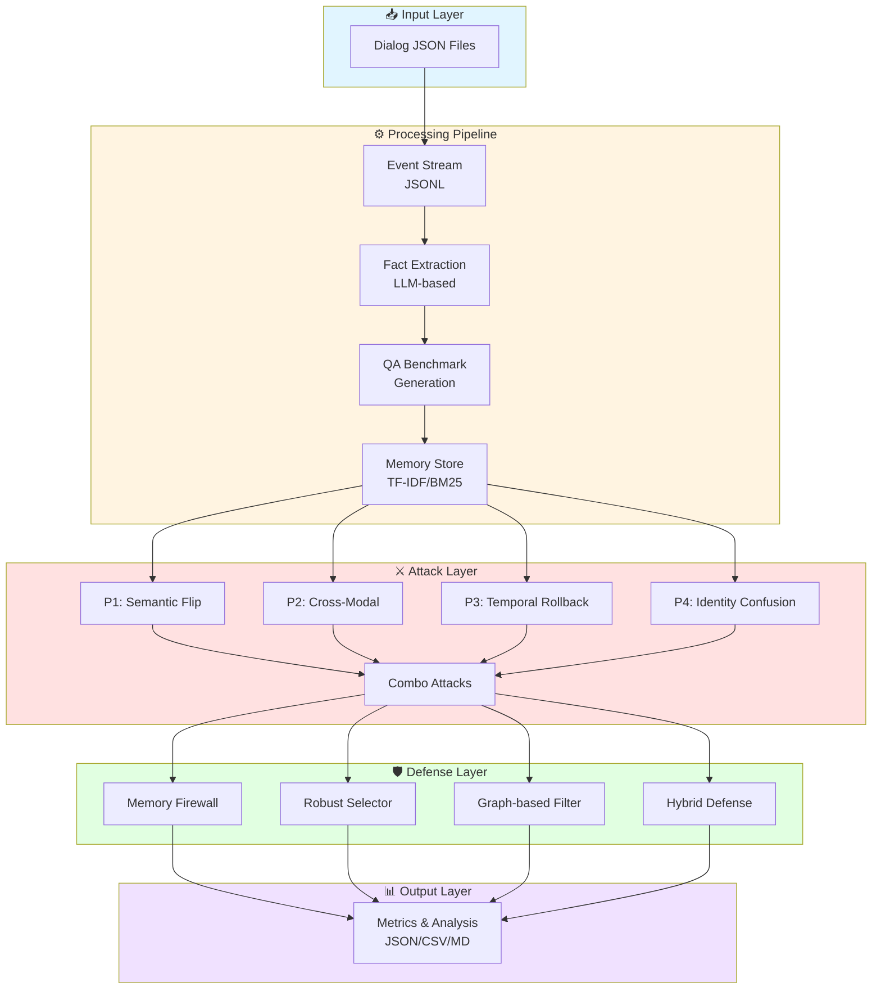
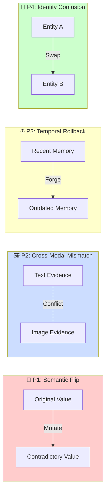
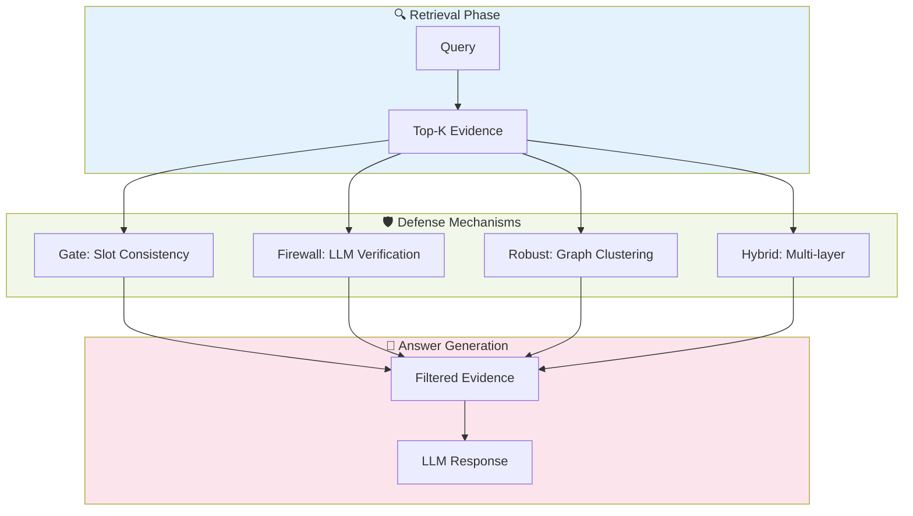

<div align="center">

# 🧠 MemPoison

### Research-grade benchmark for **poisoned external memory attacks** in LLM systems

[](https://www.python.org/downloads/)
[](LICENSE)
[](CONTRIBUTING.md)

**Comprehensive pipeline for evaluating LLM memory poisoning attacks and defenses**  
Dialogs → Facts → Benchmarks → Attacks (P1–P4) → Defenses → Metrics

[Quick Start](#quickstart) • [Documentation](#cli-reference) • [Architecture](#architecture) • [Contributing](CONTRIBUTING.md)

</div>

---

## 🎯 Overview

**MemPoison** is a research framework that transforms raw persona dialogues into a comprehensive evaluation pipeline for testing LLM systems against memory poisoning attacks. It provides:

- 📚 **Realistic Memory Store**: Timestamped event streams with multimodal evidence (text + images)
- ⚔️ **Attack Primitives**: Four core attack types (P1–P4) plus combinatorial attacks
- 🛡️ **Defense Zoo**: Multiple defense strategies including gates, firewalls, and robust selectors
- 📊 **Rich Metrics**: Accuracy, ASR, attribution hits, token costs, and more

---

## 🏗️ Architecture

### System Overview



### Attack Primitives



### Defense Strategies



---

## ✨ Key Features

### 🎭 Realistic Memory Simulation
- **Persona-based dialogues** with temporal ordering
- **Multimodal evidence** (text + image paths)
- **TF-IDF and BM25** retrieval mechanisms
- **Structured fact extraction** via LLM

### ⚔️ Comprehensive Attack Surface
| Attack Type | Description | Target |
|------------|-------------|--------|
| **P1: Semantic Flip** | Inject contradictory values | Memory content |
| **P2: Cross-Modal** | Text-image inconsistency | Multimodal evidence |
| **P3: Temporal Rollback** | Forge outdated information | Timestamp manipulation |
| **P4: Identity Confusion** | Entity attribute swapping | Entity resolution |
| **Combo Attacks** | Chain multiple primitives | Multi-vector |

### 🛡️ Defense Mechanisms
- **Memory Firewall**: LLM-based verification gates
- **Robust Selectors**: Graph-based consistency filtering
- **Slot Consistency**: Temporal and semantic checks
- **Hybrid Approaches**: Multi-layer defense stacks

### 📊 Comprehensive Metrics
- **Accuracy**: Standard and task-aware variants
- **ASR**: Attack Success Rate
- **Attribution**: Citation and source tracking
- **Cost Analysis**: Token usage and API calls
- **Poison Rate**: Contamination statistics

---

## 🚀 Quickstart

### Installation

```bash
# Clone the repository
git clone https://github.com/example/mempoison.git
cd mempoison

# Create virtual environment
python3 -m venv .venv
source .venv/bin/activate

# Install package with dev dependencies
pip install -e ".[dev]"

# Configure environment
cp .env.example .env
# Edit .env with your LLM API credentials
```

### Configuration

Edit `.env` file with your LLM gateway credentials:

```bash
MEMPOISON_LLM_API_URL=https://your-api-host.example/v1/api/chat
MEMPOISON_API_TOKEN=your_token_here
MEMPOISON_MODEL=qwen3-vl-235b-a22b-instruct
```

### Quick Test

```bash
# Verify installation
mempoison --help
pytest -q

# Run smoke test
mempoison smoke-test

# Build event stream from sample dialogs
mempoison build-events --dialog-dir dialog --out outputs/events.jsonl
```

### Full Pipeline

```bash
# Run complete attack/defense evaluation
python3 scripts/run_full_pipeline.py --eval-limit 100 --B 4

# Generate metrics report
python3 scripts/generate_full_metrics_rows_from_metrics_dir.py \
  --input-dir outputs/runs/all_attacks_100_fresh
```

---

## 📖 CLI Reference

### Core Commands

| Command | Description | Example |
|---------|-------------|---------|
| `build-events` | Convert dialogues to event stream | `mempoison build-events --dialog-dir dialog` |
| `extract-facts` | Extract structured facts via LLM | `mempoison extract-facts --events outputs/events.jsonl` |
| `build-bench` | Generate QA benchmark | `mempoison build-bench --facts outputs/facts.jsonl` |
| `build-store` | Create memory store | `mempoison build-store --facts outputs/facts.jsonl` |
| `make-attack` | Apply attack primitive | `mempoison make-attack --primitive P1 --B 4` |
| `run-defense` | Evaluate defense strategy | `mempoison run-defense --defense firewall` |
| `run-baseline` | Run baseline evaluation | `mempoison run-baseline --bench outputs/bench.jsonl` |

### Global Options

```bash
mempoison [command] \
  --model MODEL_NAME \
  --api-url URL \
  --api-token TOKEN \
  --temperature 0.7 \
  --max-tokens 2048
```

---

## 🧪 Experiment Scripts

Located in `scripts/` directory for advanced workflows:

| Script | Purpose | Use Case |
|--------|---------|----------|
| `run_full_pipeline.py` | End-to-end pipeline | Complete evaluation |
| `run_all_attacks.py` | Sweep all attack types | Attack comparison |
| `run_combo_primitives_experiment_outputs.py` | Combinatorial attacks | Multi-vector analysis |
| `run_multi_B_experiment.py` | Vary attack strength | Robustness curves |
| `run_multi_B_experiment_multi_models.py` | Multi-model evaluation | Model comparison |
| `run_enhanced_defense.py` | Advanced defense testing | Defense optimization |
| `generate_full_metrics_rows_from_metrics_dir.py` | Aggregate metrics | Report generation |

### Example: Multi-B Experiment

```bash
# Test attack strength from B=1 to B=10
python3 scripts/run_multi_B_experiment.py \
  --B-values 1 2 4 8 10 \
  --eval-limit 100 \
  --output-dir outputs/multi_b_sweep
```

---

## 📁 Project Structure

```
mempoison/
├── 📄 pyproject.toml          # Package metadata
├── 📄 README.md               # This file
├── 📄 LICENSE                 # MIT License
├── 📁 src/mempoison/          # Core library
│   ├── cli.py                 # CLI entry point
│   ├── api.py                 # LLM client
│   ├── data.py                # Event processing
│   ├── facts.py               # Fact extraction
│   ├── bench.py               # Benchmark generation
│   ├── memory.py              # Memory store
│   ├── attack.py              # Attack primitives
│   ├── defense.py             # Defense strategies
│   ├── advanced_defense.py    # Enhanced defenses
│   ├── eval.py                # Evaluation logic
│   └── assets/prompts/        # LLM prompts
├── 📁 scripts/                # Experiment runners
├── 📁 dialog/                 # Sample dialogues
├── 📁 tests/                  # Test suite
├── 📁 docs/                   # Documentation
└── 📁 outputs/                # Generated artifacts (gitignored)
```

---

## 🔧 Environment Variables

| Variable | Required | Description |
|----------|----------|-------------|
| `MEMPOISON_LLM_API_URL` | ✅ Yes | LLM API endpoint |
| `MEMPOISON_API_TOKEN` | ✅ Yes | Authentication token |
| `MEMPOISON_MODEL` | ⚠️ Recommended | Default model name |
| `MEMPOISON_USER_ID` | ⚪ Optional | Gateway user ID |
| `MEMPOISON_ACCESS_KEY` | ⚪ Optional | Gateway access key |
| `MEMPOISON_QUOTA_ID` | ⚪ Optional | Gateway quota ID |
| `MEMPOISON_REPO_ROOT` | ⚪ Optional | Override repo root path |
| `MEMPOISON_PROMPTS_DIR` | ⚪ Optional | Custom prompts directory |

---

## 📊 Output Formats

### Metrics JSON
```json
{
  "accuracy": 0.85,
  "task_aware_accuracy": 0.82,
  "asr": 0.15,
  "poison_citation_rate": 0.08,
  "attribution_hit_rate": 0.73,
  "total_cost": {"input_tokens": 125000, "output_tokens": 8500}
}
```

### Full Metrics Table
Generated as CSV, JSON, and Markdown for easy analysis and reporting.

---

## 🧪 Testing

```bash
# Run all tests
pytest

# Run with coverage
pytest --cov=mempoison --cov-report=html

# Run specific test
pytest tests/test_smoke.py -v
```

---

## 🤝 Contributing

We welcome contributions! Please see [CONTRIBUTING.md](CONTRIBUTING.md) for guidelines.

### Development Setup

```bash
# Install with dev dependencies
pip install -e ".[dev]"

# Run tests before committing
pytest -q

# Format code (if using black/ruff)
black src/ tests/
ruff check src/ tests/
```

---

## 📚 Citation

If you use MemPoison in your research, please cite:

```bibtex
@software{mempoison2024,
  title={MemPoison: Benchmark for Memory Poisoning Attacks in LLM Systems},
  author={MemPoison Contributors},
  year={2024},
  url={https://github.com/example/mempoison}
}
```

---

## ⚠️ Disclaimer

This framework is designed for **controlled research purposes only**. Attack primitives are synthetic utilities for benchmarking defenses, not operational malware. Only use with LLM endpoints and datasets you are authorized to access.

---

## 📄 License

This project is licensed under the MIT License - see the [LICENSE](LICENSE) file for details.

---

<div align="center">

### 🌟 Built with curiosity, metrics, and probably too much JSONL

**[⬆ Back to Top](#-mempoison)**

</div>
