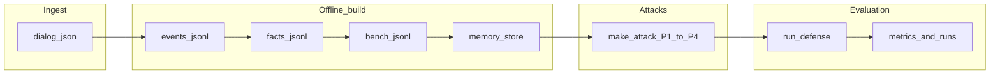
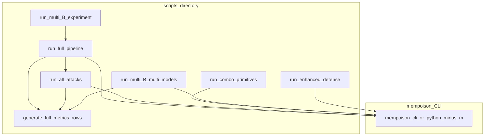

<div align="center">

# MemPoison

### Research-grade pipeline for **poisoned external memory** &nbsp;·&nbsp; dialogs → facts → benchmarks → attacks → defenses → metrics

[](https://www.python.org/downloads/)
[](LICENSE)
[](CONTRIBUTING.md)

**Evaluate retrieval + LLM answering** when an adversary mutates a structured memory store (P1–P4 primitives) and optional **combo** attacks.

</div>

---

## TL;DR

MemPoison turns **raw persona dialogues** into a **timestamped event stream**, **structured facts**, a **QA benchmark**, and a **retrievable memory store**. It then synthesizes **poisoned** store/benchmark variants, runs a **battery of defenses + baselines**, and writes **JSON/CSV metrics** suitable for papers and ablations.

> This repository is an **installable Python package** (`pip install -e .`) with prompts **bundled under** `src/mempoison/assets/prompts/`. No secrets are hard-coded: configure your LLM gateway via **environment variables** (see [`.env.example`](.env.example)).

---

## Why MemPoison?

| | |
|---|---|
| **Realistic memory** | Persona-partitioned JSONL store with TF-IDF / BM25 retrieval and multimodal evidence paths. |
| **Attack surface** | Single-primitive (**P1–P4**) and **combo** chain attacks with configurable strength `B`. |
| **Defense zoo** | Gates, firewall-style LLM checks, robust evidence selectors, hybrids (`gate+robust`, `enhanced_firewall_robust`, …). |
| **Metrics you need** | Accuracy, task-aware accuracy, ASR, poison citation rate, attribution hits, token/call costs. |

---

## Architecture

### End-to-end data plane



### Orchestration map



For a deeper breakdown see **[docs/ARCHITECTURE.md](docs/ARCHITECTURE.md)**.

---

## Quickstart

```bash
git clone https://github.com/example/mempoison.git
cd mempoison   # repository root (contains pyproject.toml)
python3 -m venv .venv && source .venv/bin/activate
pip install -e ".[dev]"
cp .env.example .env   # then fill MEMPOISON_LLM_API_URL + credentials
```

**Sanity check**

```bash
python3 -m mempoison.cli --help
pytest -q
```

**Tiny smoke run** (after `.env` is valid and you accept API spend)

```bash
python3 -m mempoison.cli build-events --dialog-dir dialog --out outputs/events.jsonl
```

**Full paper-style sweep** (clean + single-primitive attacks + all baselines)

```bash
python3 scripts/run_full_pipeline.py --eval-limit 100 --B 4
python3 scripts/generate_full_metrics_rows_from_metrics_dir.py \
  --input-dir outputs/runs/all_attacks_100_fresh
```

> Run long jobs from the **repository root** so relative paths like `outputs/` and `dialog/` resolve correctly. If you cannot, set `MEMPOISON_REPO_ROOT`.

---

## Install

| Method | Command |
|--------|---------|
| Editable (recommended) | `pip install -e ".[dev]"` |
| CLI entry point | `mempoison --help` (after install) |
| Legacy shim | `python3 run.py --help` (adds `src/` to `sys.path` automatically) |

---

## CLI reference (`mempoison.cli`)

| Subcommand | Purpose |
|------------|---------|
| `build-events` | Linearize multi-session dialogues → `events.jsonl`. |
| `extract-facts` | Multimodal LLM extraction → `facts.jsonl`. |
| `build-bench` | Generate / balance QA items → benchmark JSONL. |
| `translate-bench` | Optional EN translation pass. |
| `build-store` | Compile **fact** or **raw** memory rows. |
| `build-raw-index` | Raw-index variant (optional pipeline). |
| `make-attack` | Apply **P1–P4** poison primitive to store + bench. |
| `run-defense` | End-to-end retrieval + defense + answering + metrics. |
| `run-baseline` | Simplified single-scenario runner. |
| `smoke-test` | Single image+text LLM ping. |

Global flags include `--model`, gateway credentials, decoding knobs—see `python3 -m mempoison.cli --help`.

---

## Experiment scripts

Located under **`scripts/`** (each bootstraps `src/` on `sys.path` so `python3 scripts/...` works before install).

| Script | What it does |
|--------|----------------|
| [`scripts/run_full_pipeline.py`](scripts/run_full_pipeline.py) | Build data → P1–P4 attacks → `run_all_attacks` → wide metrics table. |
| [`scripts/run_all_attacks.py`](scripts/run_all_attacks.py) | Assumes artifacts exist; sweeps **clean + P1–P4** for every baseline. |
| [`scripts/run_combo_primitives_experiment_outputs.py`](scripts/run_combo_primitives_experiment_outputs.py) | **Combo** attacks (pairs/triples/all four) + baselines. |
| [`scripts/run_multi_B_experiment.py`](scripts/run_multi_B_experiment.py) | Grid over **B** via `run_full_pipeline`. |
| [`scripts/run_multi_B_experiment_multi_models.py`](scripts/run_multi_B_experiment_multi_models.py) | Grid over **B × models** (passes per-model CLI flags; **redacts** secrets in logs). |
| [`scripts/run_enhanced_defense.py`](scripts/run_enhanced_defense.py) | Focused sweep for one `--defense` across scenarios. |
| [`scripts/generate_full_metrics_rows_from_metrics_dir.py`](scripts/generate_full_metrics_rows_from_metrics_dir.py) | Flattens `*_metrics.json` → `full_metrics_rows.{csv,json,md}`. |

---

## Configuration (environment)

| Variable | Required | Meaning |
|----------|----------|---------|
| `MEMPOISON_LLM_API_URL` | **Yes** | HTTPS endpoint for the chat/completions-style API used by `LLMClient`. |
| `MEMPOISON_API_TOKEN` | Usually | Bearer / gateway token (header). |
| `MEMPOISON_USER_ID`, `MEMPOISON_ACCESS_KEY`, `MEMPOISON_QUOTA_ID` | Gateway-dependent | Routed in JSON metadata. |
| `MEMPOISON_TAG`, `MEMPOISON_APP` | Optional | Extra routing tags for some gateways. |
| `MEMPOISON_MODEL` | Optional | Default `--model` for CLI. |
| `MEMPOISON_REPO_ROOT` | Optional | Force repository root when running scripts outside the clone. |
| `MEMPOISON_PROMPTS_DIR` | Optional | Override packaged prompts directory. |

`python-dotenv` loads **`.env` from the repository root** on CLI startup.

---

## Repository layout (high level)

```
├── pyproject.toml          # package metadata + console_scripts
├── README.md               # you are here
├── LICENSE                 # MIT
├── CONTRIBUTING.md
├── docs/ARCHITECTURE.md
├── src/mempoison/          # library + cli + packaged prompts
├── scripts/                # experiment drivers
├── dialog/                 # sample corpus
├── data/README.md          # notes on custom data
├── tests/                  # pytest smoke tests
└── outputs/                # created at runtime (gitignored)
```

---

## Testing & CI

```bash
pytest -q
```

GitHub Actions workflow: [`.github/workflows/ci.yml`](.github/workflows/ci.yml) (Python 3.10–3.12).

---

## Contributing & citation

See **[CONTRIBUTING.md](CONTRIBUTING.md)**. If this artifact accompanies a publication, please cite the paper / Zenodo DOI when available and pin the **git commit** you used for numbers in tables.

---

## Disclaimer

This code is intended for **controlled research**. Only run it against LLM endpoints and datasets you are authorized to use. Attack primitives are **synthetic** utilities for benchmarking defenses—not operational malware.

---

<div align="center">

Made with **curiosity**, **metrics**, and probably too much JSONL.

</div>
